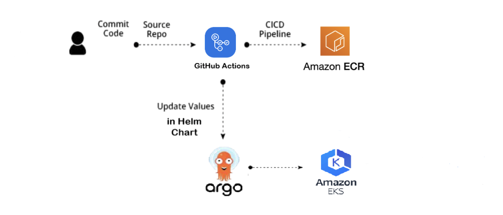
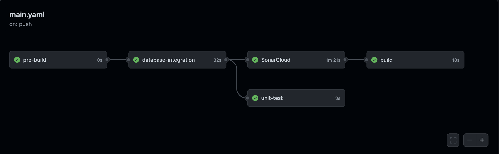
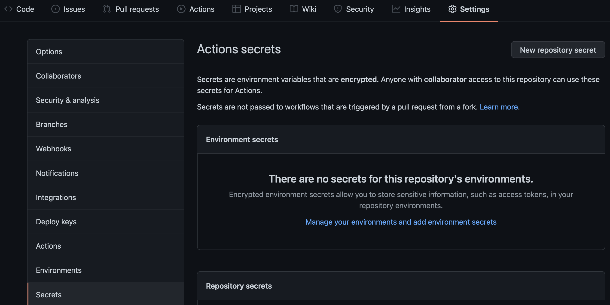
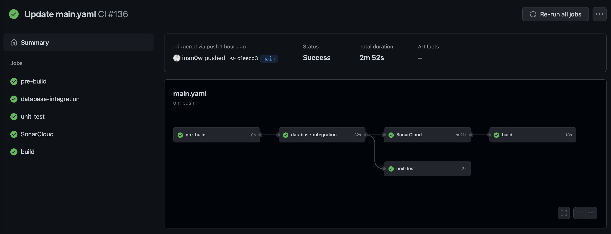
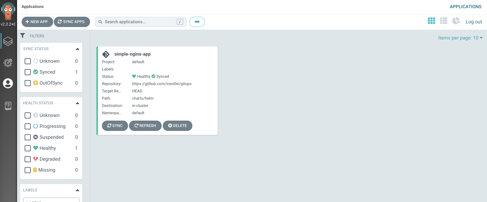

**CI/CD using GitHub Actions and ArgoCD on Kubernetes**

GitOps is one of the hottest topics in the world of DevOps as it’s an evolution of Infrastructure as Code (IaC) and a DevOps best practice that leverages Git as the single source of truth, and control mechanism for creating, updating, and deleting system architecture. 
More simply, GitOps is a way of implementing Continuous Deployment for cloud-native applications.

Setting up a CI/CD workflow with GitHub Actions and ArgoCD and to deploy applications to Kubernetes cluster (AWS EKS Cluster or Local).

**Workflow**

Use GitHub Actions to build Docker Image of the application and then push the image to a private ECR (Elastic Container Image) repository. And then update the version of the new image in the Helm Chart.

**STEPS:**

- Nginx with HTML webpage and Dockerfile in GitHub repo.

       ## index.html
       <Html>
       <body>
       

       <h1>This is the demo for Continuous Deployment on Kubernetes with GitOps and ArgoCD</hi>  
        
       

       </body>
       </Html>

- Create Dockerfile

      From nginx:latest
      COPY index.html /usr/share/nginx/html
      
- Create a GitHub Actions in the repository to build the docker image from the Dockerfile present in the repo and then push the image to AWS ECR private. repository.

# YAML code

    runs-on: ubuntu-latest 
 
    steps:
        - name: Checkout
          uses: actions/checkout@v2

        - name: Configure AWS credentials
          uses: aws-actions/configure-aws-credentials@v1
          with:
            aws-access-key-id: ${{ secrets.AWS_ACCESS_KEY_ID }}
            aws-secret-access-key: ${{ secrets.AWS_SECRET_ACCESS_KEY }}
            aws-region: us-east-1

        - name: Login to Amazon ECR
          id: login-ecr
          uses: aws-actions/amazon-ecr-login@v1

        - name: Build, tag, and push image to Amazon ECR
          id: build-image
          env:
            ECR_REGISTRY: ${{ steps.login-ecr.outputs.registry }}
            ECR_REPOSITORY: gitops
            IMAGE_TAG: ${{ github.sha }}
          run: |
            # Build a docker container and
            # push it to ECR so that it can
            # be deployed to ECS.
            docker build -t $ECR_REGISTRY/$ECR_REPOSITORY:$IMAGE_TAG .
            echo "Pushing image to ECR..."
            docker push $ECR_REGISTRY/$ECR_REPOSITORY:$IMAGE_TAG
            echo "::set-output name=image::$ECR_REGISTRY/$ECR_REPOSITORY:$IMAGE_TAG"
        
        - name: Update Version
          run: |
           git_hash=$(git rev-parse --short "$GITHUB_SHA")
           version=$(cat ./charts/helm/values.yaml | grep version: | awk '{print $2}')
           sed -i "s/$version/${GITHUB_REF##*/}-$git_hash/" ./charts/helm/values.yaml
          
        - name: Commit and push changes
          uses: devops-infra/action-commit-push@v0.3
          with:
              github_token: ${{ secrets.GITHUB_TOKEN }}
              commit_message: Version updated

- Create test to scan code with SonarCloud.

            SAST:
              name: SonarCloud
              runs-on: ubuntu-latest
              steps:
                - uses: actions/checkout@v2
                  with:
                    fetch-depth: 0  # Shallow clones should be disabled for a better relevancy of analysis
                - name: SonarCloud Scan
                  uses: SonarSource/sonarcloud-github-action@master
                  env:
                    GITHUB_TOKEN: ${{ secrets.GITHUB_TOKEN }}  # Needed to get PR information, if any
                    SONAR_TOKEN: ${{ secrets.SONAR_TOKEN }}
                    
  
 - AWS account IAM secret key and access key, so that GitHub can able to access my ECR repository and push the image.
 - Store credentials in a secret in GitHub repository.
 
 
 
 - Triggered and start building and pushing the image and updates the version of the new image.
 
 
 
 # Installing ArgoCD in Kubernetes Cluster
 
    helm repo add argo https://argoproj.github.io/argo-helm
    helm install argocd argo/argo-cd --set server.service.type=LoadBalancer

- Next create an App in ArgoCD in which define where is application's Helm Chart located and where to deploy it.

